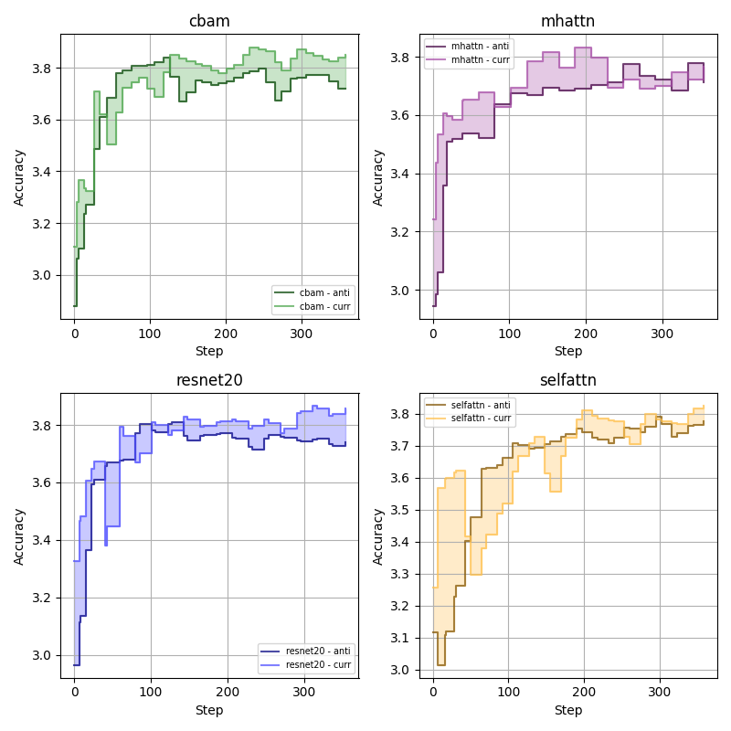
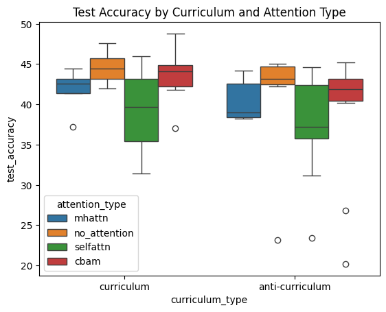
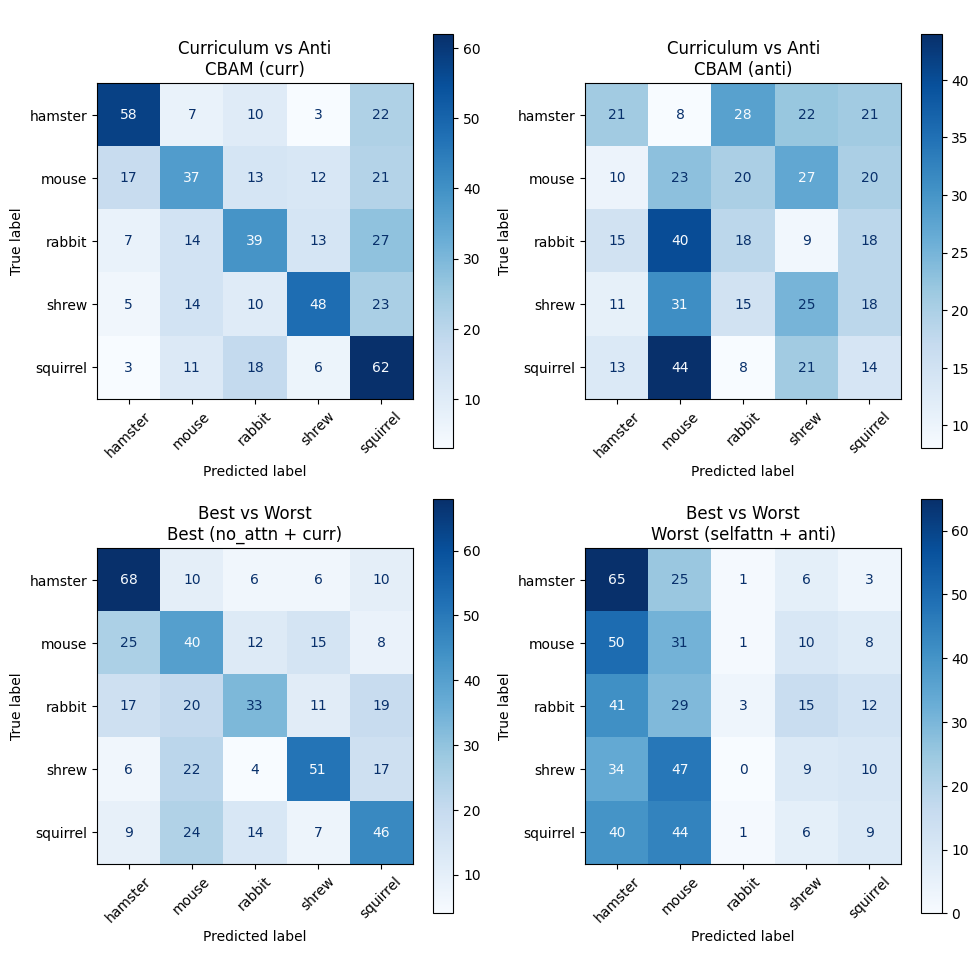
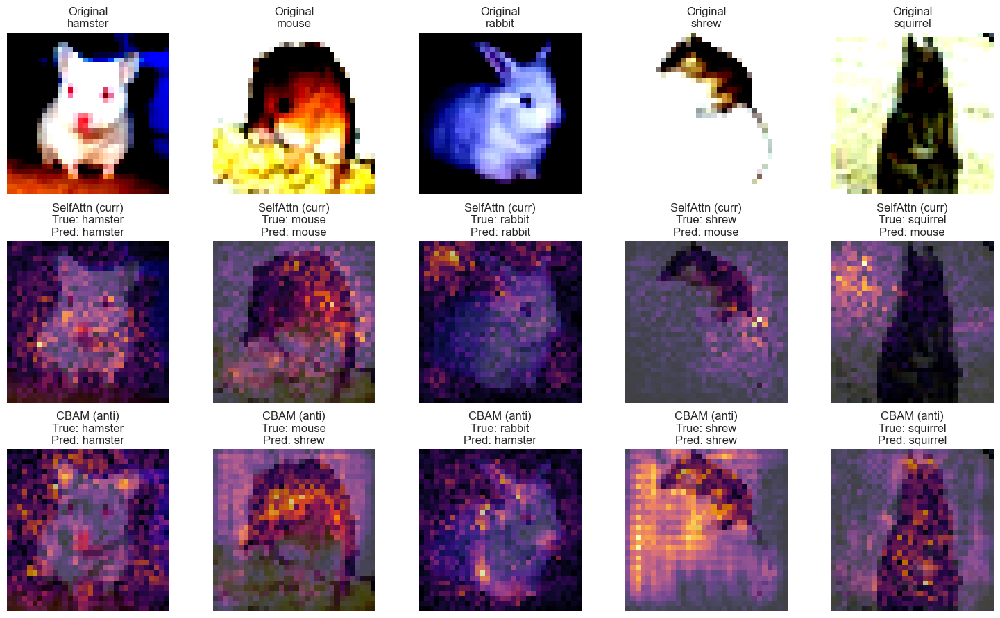

<!-- PROJECT SHIELDS
[![Contributors][contributors-shield]][contributors-url]
[![Forks][forks-shield]][forks-url]
[![Stargazers][stars-shield]][stars-url]
[![Issues][issues-shield]][issues-url]
[![MIT License][license-shield]][license-url]
-->

<!-- PROJECT TITLE -->
 

  <h3 align="center">Because Order Counts: Curriculum Learning with Attentions in CNNs</h3>

 
  

    <strong> <a href="https://github.com/LihiShalmon/Attention_Under_Curriculum_Learning/blob/main/images/experiments_with_carriculum_learning.pdf">🔗Full reports</a></strong>
    <strong> <a href="https://wandb.ai/lihi-shalmon-huji-hebrew-university-of-jerusalem/CNN_With_Curriculum_Learning/sweeps">🔗 W&b dashboards</a></strong>
    

    <strong>Contributors:</strong> Luay Muhtaseb1, LihiShalmon
  

Our work investigates whether sequencing training data from simple to complex (curriculum learning) can boost the performance of attention-augmented CNNs compared to traditional CNNs. Our experiments compare a baseline ResNet-20 with multiple attention mechanisms using a challenging subset of CIFAR-100.
     
  

  

 
  

  

      

## 📚 Paper Insights

- **Curriculum Effectiveness:** Curriculum learning significantly improves test accuracy (up to a 2.55% increase) over anti-curriculum methods.
- **Attention Mechanisms:** While attention modules like CBAM and MHA offer modest gains, the baseline ResNet-20 without attention still outperforms attention-augmented variants in this limited-data scenario.
- **Hyperparameter Impact:** Learning rate is identified as the most critical hyperparameter, with strong implications for model performance.
- **Visual Analysis:** Confusion matrices and saliency maps reveal that curriculum learning helps sharpen class separability, even under challenging conditions.

For detailed plots, logs, and performance metrics, please explore the Experiments section.

  

## 🔍 Methodology

Our approach is divided into three main components:

### 1. Curriculum Learning
- **Objective:** Improve model convergence and generalization by gradually introducing training complexity.
- **Process:** 
  - **Scoring:** Each training sample is assigned a difficulty score using a predefined function.
  - **Ordering:** Samples are sorted from easiest to hardest, ensuring the model learns fundamental patterns first.
  - **Pacing:** The number of training samples increases over epochs, allowing the model to progressively tackle more challenging examples.
- **Benefits:** This structured training helps the model avoid being overwhelmed by complex data early on, especially under limited data conditions.

### 2. Attention Augmentation
- We wanted to see if we could enhance the performence of Attention augmented CNN's. 
- **We tested the following models:**
  - **Self-Attention:** Uses 1×1 convolutions to learn spatial dependencies.
  - **Multi-Head Self-Attention (MHA):** Leverages multiple heads to capture diverse long-range features.
  - **Convolutional Block Attention Module (CBAM):** Combines channel and spatial attention to focus on critical features.
- **Implementation:** These modules are incorporated between the layers of the baseline ResNet-20, balancing added complexity with computational efficiency.

### 3. Evaluation
- **Statistical Analysis:** 
  - **ANOVA, T-tests, and Tukey's HSD:** Assess the significance of curriculum learning and attention modules on model performance.

  - 
- **Visualization Tools:**
  - **Accuracy Trends:** Monitor how performance evolves over training iterations.
  - **Confusion Matrices:** Visualize model misclassifications and class separation.
  - **Saliency Maps:** Highlight image regions that most influence the model's predictions.

- **Hyperparameter Tuning:** 
  - **Bayesian Optimization:** Fine-tune critical parameters (e.g., learning rate, pacing function) to ensure robust model performance.

    
  

